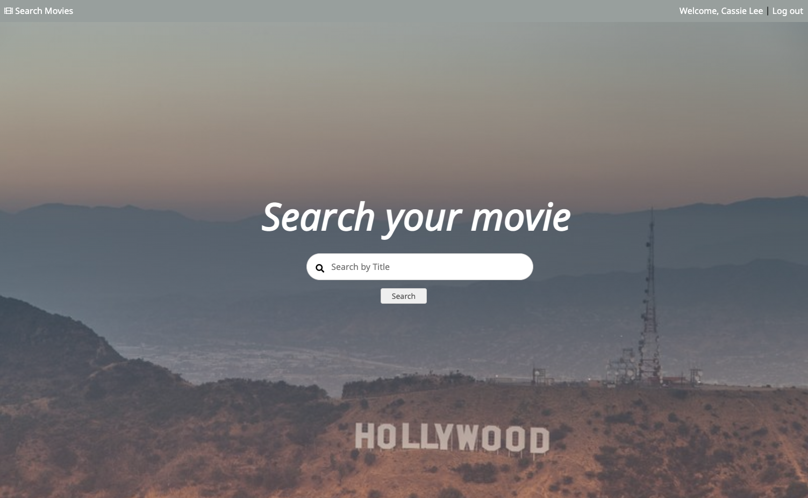
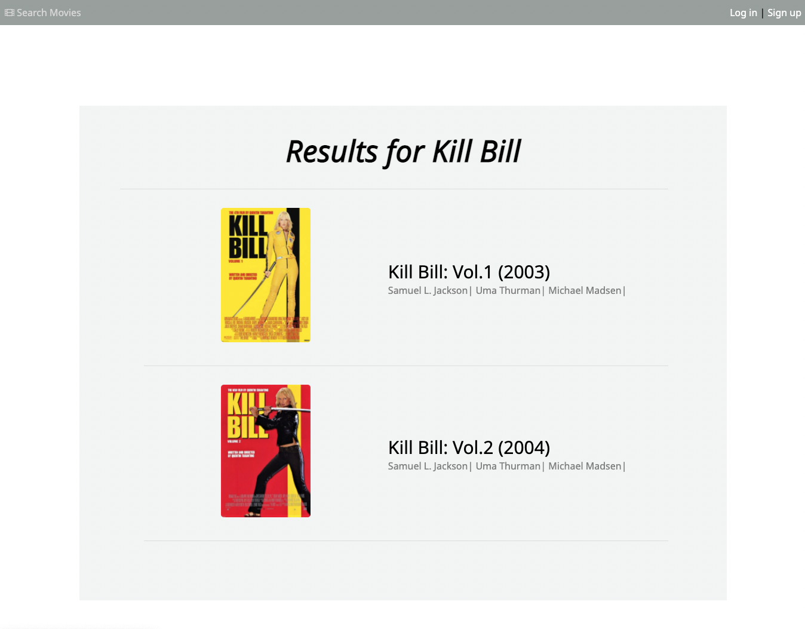
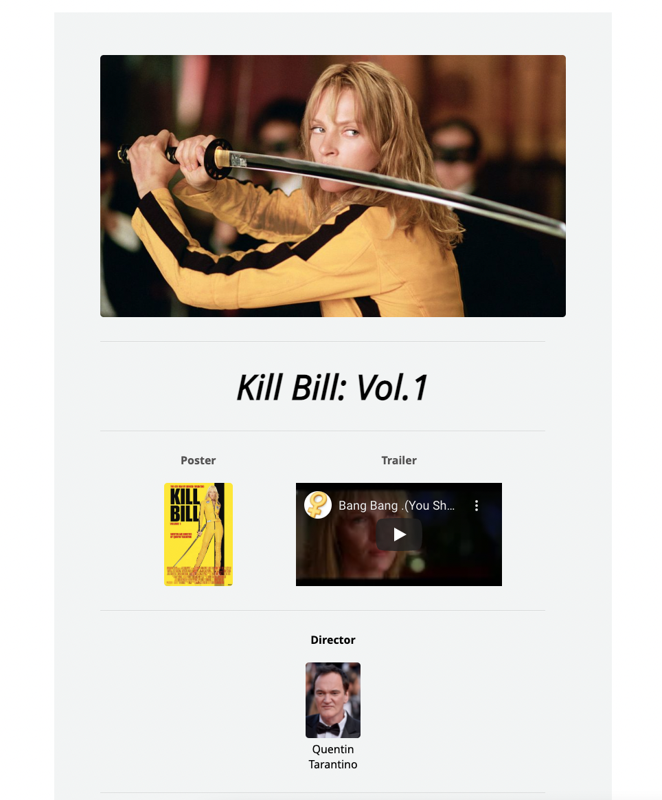
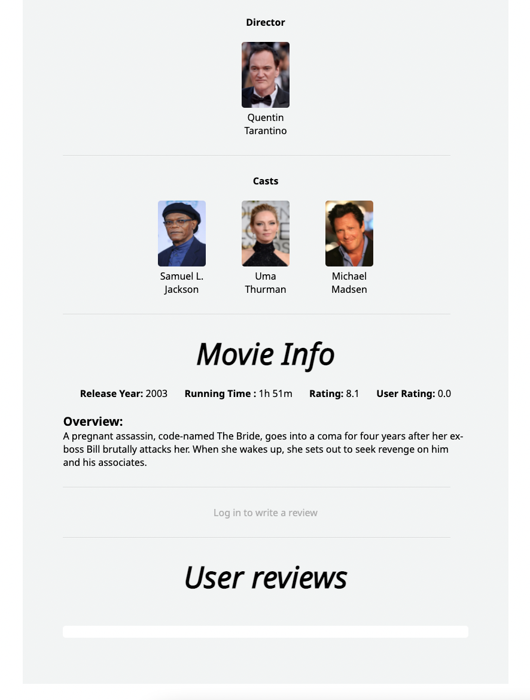

# MOVIE SEARCH DB

Welcome to the Movie search database!

You can search, write a review and rate a movie by clicking the link : [Movie Search](https://floating-taiga-80430.herokuapp.com/) 

### Description
***

1. Home page  
You can simply begin by typing in the title of a movie in the search box in the middle.

 
2. Movie index page 
When it goes to the index page of the searched movie, you can see the details of the movie by clicking the title or image of the movie. You can add the movie to the watchlist by clicking the plus button on the very right-hand side and this feature is restricted to logged-in users.

 

3. Movie detail page  
You can see the details of the movie on this page. If you want to explore the filmography of the director and casts, you can simply click their name and it will direct you to the page where you can see the list of their movies. I have placed 2 rating systems in the 'Movie Info', the first rating is from the movie rating website and the second rating is the average of the users rating. Just below the 'movie info' section is the user review section and this is another feature for logged in users.

 

4. Sign-up feature  
   You can expand your experience at the Movie Search site by signing up. Click the sign-up button in the top right corner. You can upload your profile image by clicking the choose file button but it's not compulsory. If you sign up without uploading the user image, you will still get a default user image. 
 
4.1 User Section  
When you hover over the top nav bar that says Welcome, 'Your name', you will see 3 menus. In the profile section, you can see your details and the edit button. You can also edit your details by clicking the edit button. 
 
4.2 
Below the usre profile, you can see 'Watchlist' and 'Your Rating' menu. You can find your history of reviews in Your Rating menu and your history of watchlist in Watchlist menu. In both features, you can edit the review and you also can go back to the movie detail page by clicking the movie image.  
 

The index of movies are followings:

1. Thema & Louise
2. Dune
3. Pulp Fiction
4. Kill Bill Vol.1
5. Kill Bill Vol.2
6. Inglourious Basterds
7. Django Unchained
8. Once Upon a Time in Hollywood
9. The Rocky Horror Picture Show
10. Inside Llewyn Davis
11. Fargo
12. Jackie Brown
13. Burn After Reading
14. Blade Runner 2049
15. Beetlejuice

